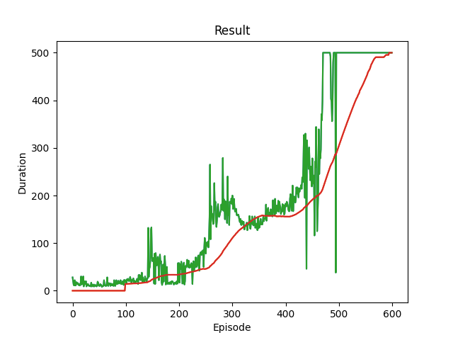
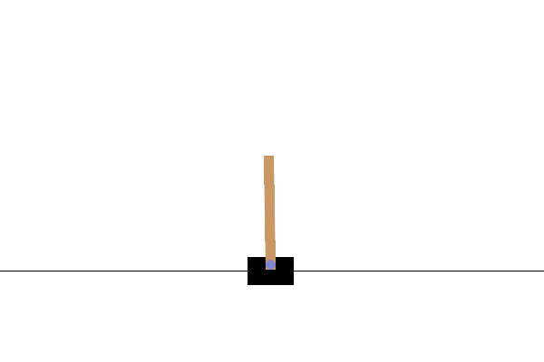

# Basic Deep Q Learning with Pytorch

An reproduced code from [Reinforcement Learning (DQN) Tutorial](https://pytorch.org/tutorials/intermediate/reinforcement_q_learning.html) to learn about Deep Reinforcement Learning

## How to run

Training and convert model to onnx with `main.py`

Runing onnx model inference with `run.py`

## Result

Visualize training result

Visualize environment result 

## Reference

- [Reinforcement Learning (DQN) Tutorial](https://pytorch.org/tutorials/intermediate/reinforcement_q_learning.html)
- [boringtutor/makeGifFromGymOpenAi](https://github.com/boringtutor/makeGifFromGymOpenAi)